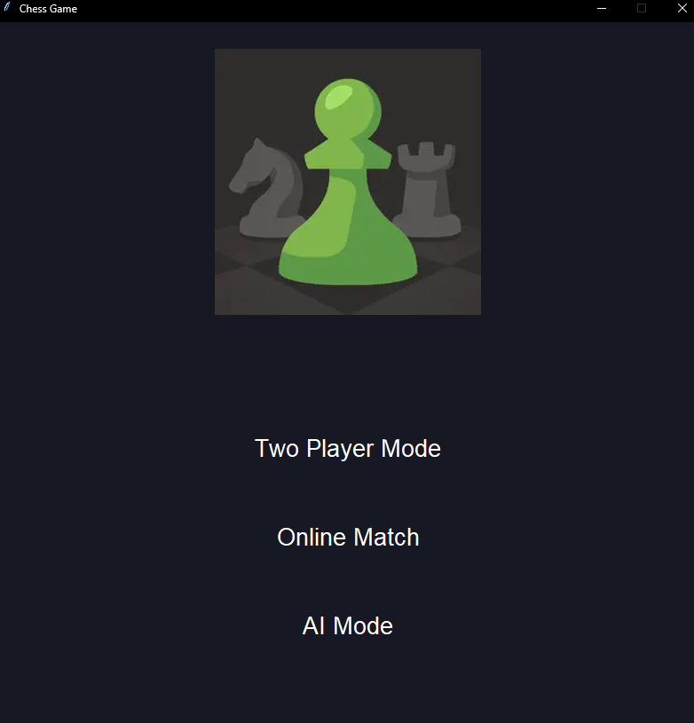
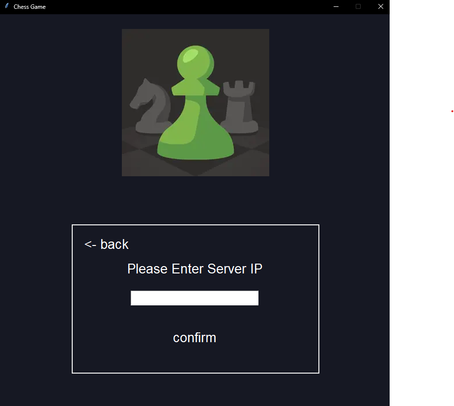
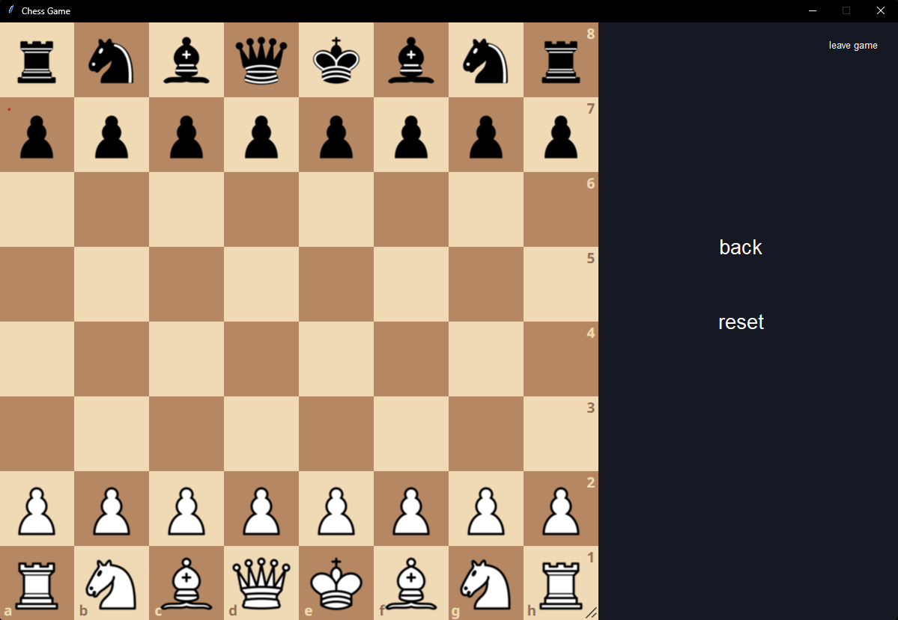

# 自主學習成果 主題:西洋棋,多人連線,AI

## 連結

* [Github link](<https://github.com/qwerty121938/Self-directed-Learning> "GIthub")
* [HackMD link](<https://hackmd.io/@PL6cdaDdSdGTd_P_M5p7FA/SyjX8dVBC)> "HackMD")
* [Download Page](<https://github.com/qwerty121938/Self-directed-Learning/releases/tag/v1.1> "Download")

  
* 警告 : `伺服器端及客戶端有pickle的漏洞有可能被攻擊請小心執行`
> 遊戲裡面的AI模式並不是真正的AI，因為考慮到AI的效率極低導致卡頓，所以
> 我把設定改為前面測試時的隨機函數，但是我還是把AI的函式留在檔案內
> 
> 遊戲裡面的AI模式並不是真正的AI，因為考慮到AI的效率極低導致卡頓，  
> 所以我把設定改為前面測試時的隨機函數，但是我還是把AI的函式留在檔案內

[AI Module檔案](./client/ai_module.py)
## 如何啟動遊戲

>這個遊戲分成三個模式
>* 雙人
>* 連線
>* AI
>
>其中連線模式需要有伺服器才能進行

### 如何進行連線模式
* 客戶端
    * 需要下載文件並且解壓縮
    * 連結(下載`game.zip`就好) : [click me](<https://github.com/qwerty121938/Self-directed-Learning/releases/tag/v1.1> "Download")
    * 解壓縮
    * 開啟`start.exe`即可遊玩

>註 : 此檔案有可能被系統偵測為病毒原因是有使用到系統指令請放心使用

* 伺服器媏
    
    
    * 伺服器媏需要裝python
    * 連結(下載`server.zip`就好) : [click me](<https://github.com/qwerty121938/Self-directed-Learning/releases/tag/v1.1> "Download")
    * 下載好後解壓縮
    * 運行`server.py`
    * 客戶端可以開始連線了
    

>註 : 這遊戲外網、內網皆可連線，外網請自行解決，內網直接輸入伺服器開啟時顯示的ip就好  
>後面的port不用輸入  
>例如 : `192.168.1.103:1080`
>上述例子只需要輸入`192.168.1.103`就好

## 成果展示

- 初始介面

- 連線介面

  

- 遊戲畫面(所有模式都差不多長這樣)

  

